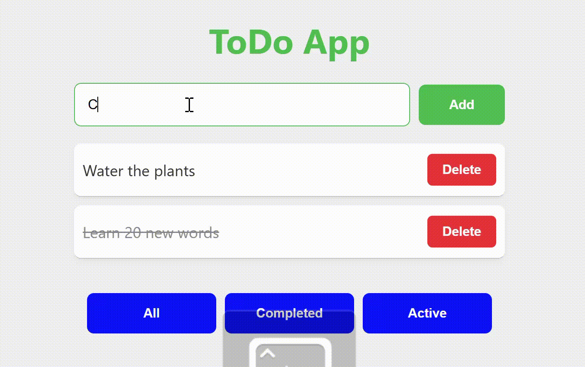

# 🗒️ To-Do App with Filters (React)



This is a simple To-Do application built with React that allows users to add, mark as completed, delete, and filter tasks by status.  
It was created as a beginner front-end project to practice React fundamentals such as `useState`, props, and component composition.

## ✨ Features
- Add new tasks 🆕  
- Mark tasks as completed ✅  
- Delete tasks ❌  
- Filter by “All / Completed / Pending” 🔍  
- Clean and responsive UI 🖥️📱  

## 🧠 Technologies Used
- React 19  
- JavaScript (ES6+)  
- HTML5 & CSS3  
- npm & React Scripts  

<!-- ## 🧩 Project Structure
todo-app/
├── src/
│   ├── components/
│   │   ├── AddTodo.jsx
│   │   ├── TodoItem.jsx
│   │   └── TodoList.jsx
│   ├── App.jsx
│   └── index.js
├── package.json
└── README.md -->

## 🚀 How to Run the Project

1. Clone the repository:
   ```bash
   git clone https://github.com/HectorNieto00/react-todo-app.git

2. Navigate into the project folder:
    cd todo-app

3. Install dependencies:
    npm install

4. Start the app:
    npm start

## 💡 Lessons Learned

- How to manage state using `useState`  
- How to pass data between components using props  
- The importance of component reusability and clear separation of logic  
- Basic debugging with React DevTools  

## 🌱 Next Improvements

- Add local storage to save tasks  
- Add categories or priorities  
- Implement dark mode  
- Add animations when adding/removing tasks  

## 👩‍💻 Author

**Hector Nieto**    
💼 Software Engineer | MSc Big Data and Data Science Technology
📍 London, UK

### 🔗 Encuéntrame en:
[LinkedIn](https://www.linkedin.com/in/hector-nieto-ruiz-753202169/) | [GitHub](https://github.com/HectorNieto00)
